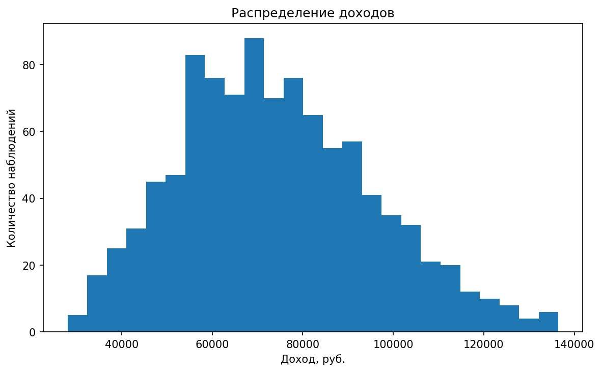
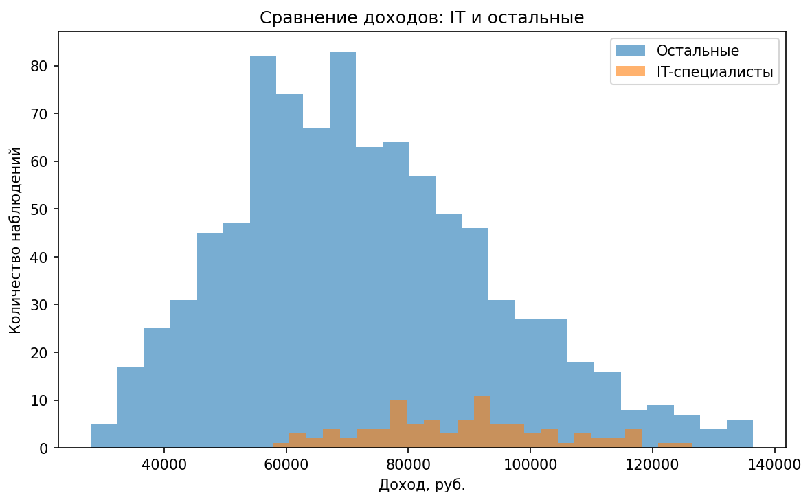
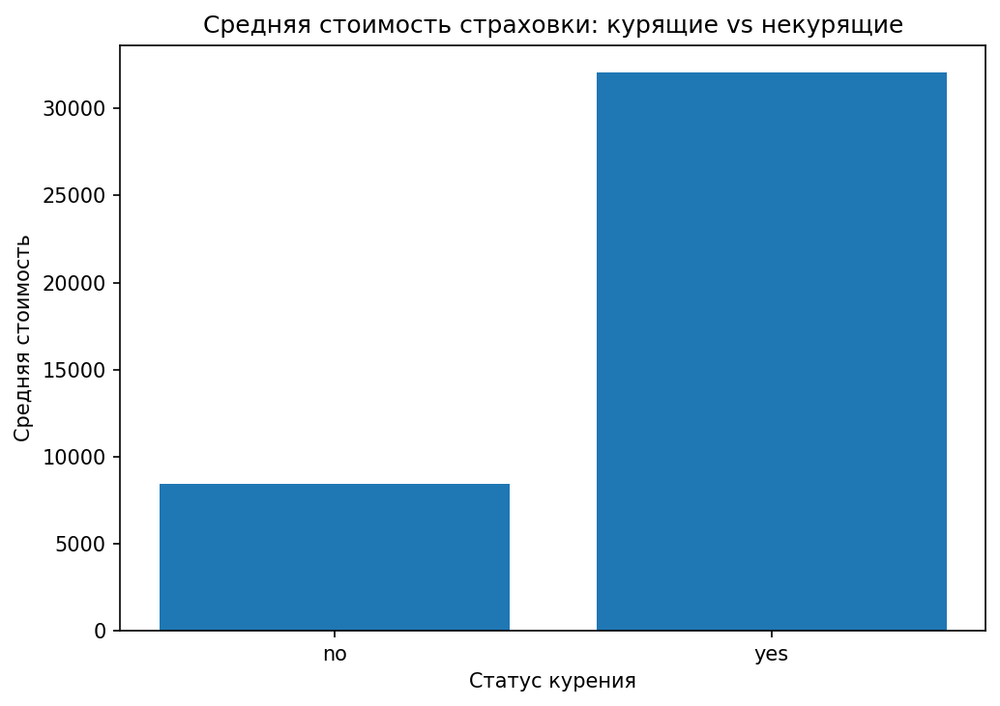
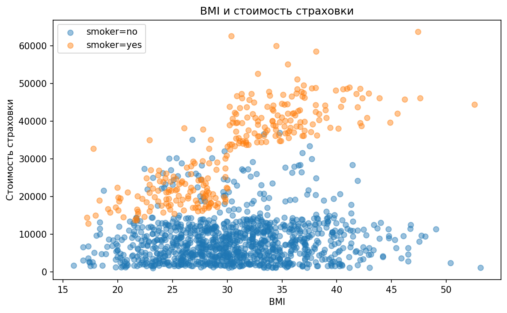
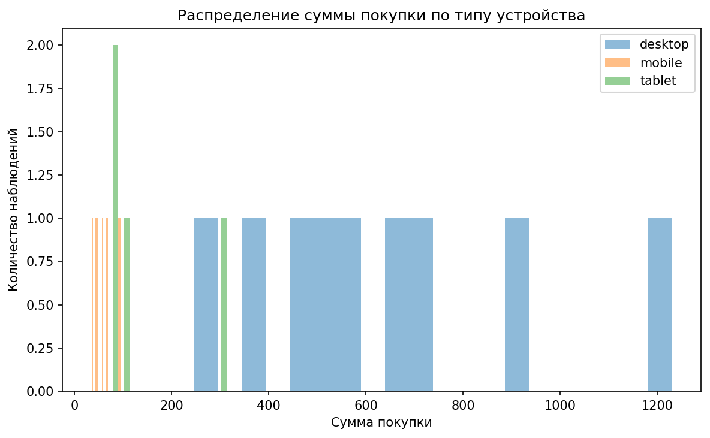

# EDA: доходы, страхование и поведение пользователей в e-commerce

## О проекте

Этот репозиторий объединяет несколько задач по исследовательскому анализу данных и показывает, как с помощью статистического мышления и визуализации можно изучать распределения, сравнивать группы и получать понятные выводы.

Вместо одного узкого кейса здесь собрана серия аналитических мини-исследований, каждое из которых иллюстрирует важный элемент работы аналитика:
- анализ распределений;
- сравнение подвыборок;
- поиск факторов, связанных с целевой метрикой;
- интерпретация пользовательского поведения.

## Что входит в анализ

### 1. Доходы в Краснодаре
Рассматривается распределение доходов в выборке и отдельно анализируется сегмент IT-специалистов.  
Это позволяет показать, как сравнивать общую совокупность и конкретную профессиональную группу, а также как визуально и статистически интерпретировать различия.

### 2. Страхование
Исследуется связь между стоимостью страховки, статусом курения и индексом массы тела.  
Этот блок хорошо демонстрирует умение работать с факторами, которые могут по-разному влиять на метрику в разных подгруппах.

### 3. E-commerce
Рассматриваются пользовательские данные интернет-магазина, включая поведение по типу устройства и сумму покупки.  
Здесь показан переход от просто визуализации к аналитическим выводам о пользовательских сегментах.

## Используемые файлы

- Ноутбук: `eda_income_insurance_ecommerce.ipynb`
- Данные:
  - `data/krasnodar_income.csv`
  - `data/insurance.csv`
  - `data/ecommerce_user_behavior.csv`

## Структура папки

```text
eda-income-insurance-ecommerce/
├── README.md
├── README_images.md
├── eda_income_insurance_ecommerce.ipynb
├── data/
│   ├── krasnodar_income.csv
│   ├── insurance.csv
│   └── ecommerce_user_behavior.csv
└── images/
    ├── income_distribution.png
    ├── income_it_vs_all.png
    ├── insurance_smoker_charges.png
    ├── insurance_bmi_vs_charges.png
    └── ecommerce_purchase_by_device.png
```

## Что сделано в проекте

- исследованы распределения на нескольких датасетах;
- выделены и сравнены отдельные группы наблюдений;
- построены гистограммы и сравнительные визуализации;
- рассмотрены факторы, связанные с ключевыми метриками;
- сформулированы аналитические выводы на основе структуры данных.

## Почему проект важен

Этот проект показывает широту базовых аналитических навыков:
- умение быстро ориентироваться в новых данных;
- умение смотреть не только на среднее, но и на форму распределения;
- умение разбивать данные на сегменты и сравнивать подгруппы;
- умение визуально объяснять полученные результаты.

## Какие навыки показывает проект

- EDA;
- сегментация;
- анализ распределений;
- визуализация данных;
- формулирование и проверка аналитических гипотез;
- сравнительный анализ подвыборок.

## Визуализации










